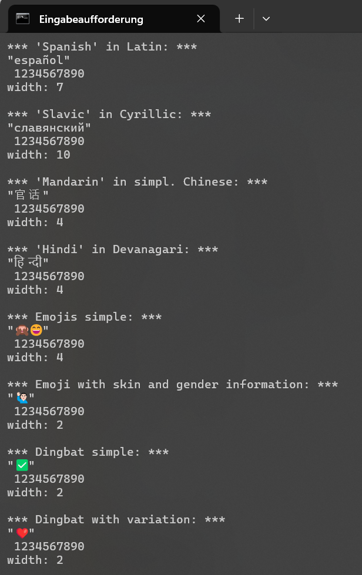

## **`wtswidth` - Windows Terminal string width**  

The purpose of this C library along with the released utility is to count the number of columns required to represent a string in the [Windows Terminal](https://github.com/microsoft/terminal).  
You may use it if you want to perform some kind of tabulation or centering of text where it is necessary to know upfront how much space a string is going to occupy in the window.  
 
  
With version 1.22, Windows Terminal made a huge step towards better Unicode support and Unicode correctness. This is something that I can't appreciate enough. A series of major "minor refactorings" (© [@lhecker](https://github.com/lhecker) 😄) have been made to achieve that.  
The name `wtswidth` intentionally sounds similar to the POSIX function `wcswidth()`. However, measuring the display width of a string in Windows Terminal is now not only based on the sum of expected widths of codepoints like in `wcswidth()`. The string context is taken into account, too. This leads to a far better measuring of clustered graphemes.
 
  
*But what does that mean?*  
Let's just perform some comparisons:  

| **string** | **C syntax** | `wtswidth` **(this)** | `wcswidth()` **(wchar.h GCC)** |
| :--- | :--- | :---: | :---: |
| `abc` | L"abc" | 3 | 3 ✔ |
| `हिन्दी` | L"\u0939\u093F\u0928\u094D\u0926\u0940" | 4 | 5 ❌ |
| `😄` | L"\U0001F604" | 2 | 2 ✔ |
| `🙋🏻‍♂️` | L"\U0001F64B\U0001F3FB\u200D\u2642\uFE0F" | 2 | 5 ❌ |
| `❤️` | L"\u2764\uFE0F" | 2 | 1 ❌ |

However, this does not quite demonstrate how it looks like in the terminal.  
That's a screenshot of a test script in Windows Terminal Canary Version 1.23.2421.0:  
  
As you can see, the measured width matches the displayed width of the strings each.  
I doubt it's perfect. But due to the lack of any standardization we can't even evaluate how close to perfection it actually is. At least a proposal was already submitted to the UTC (see 
[Proper Complex Script Support in Text Terminals.](https://www.unicode.org/L2/L2023/23107-terminal-suppt.pdf)) of how this should be ideally implemented.  
 
  
### **How to use?**  
This is a C library that you may use in your C or C++ project by adding `wtswidth.h` and `wtswidth.c`. Include `wtswidth.h` in the source file where you need to measure the width of a string as displayed in the terminal.  
However, you may use the library in managed code like C# or PowerShell, too. The needed DLL file is included in the [Release Assets](https://github.com/german-one/wtswidth---Windows-Terminal-string-width/releases/latest) for Windows.  
The release also contains a command line tool, compiled from `main.c`, that can be used to measure one or more strings at once.  
 
  
### **Most of this is not my intellectual property.**  

It is basically a copy of the recently revised code for this purpose in Microsoft's open source repository. All credits go to their Terminal team and contributors. I used this code in order to actually get the same results as the internally performed measurements. For more information refer to the comments in the source files.  
Furthermore I modified Björn Höhrmann's "Flexible and Economical UTF-8 Decoder" to process UTF-8 input.  
  
See: [Third Party Licenses](./NOTICE.md)  
  
 
